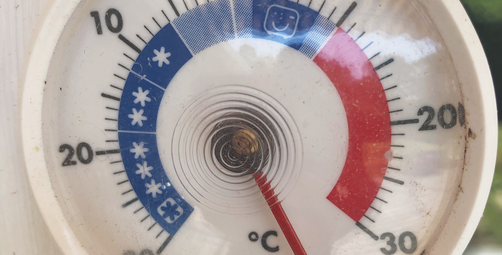

When I first learned about web development, CGI scripts was a thing and PHP was in version 3.x 😲 After not so long, I got confident with the [LAMP stack](<https://en.wikipedia.org/wiki/LAMP_(software_bundle)>), and it has been the setup on a majority of the projects I have worked on. That became my comfort zone.

Sure, since then I have done some hacking with the [CodeKit app](https://codekitapp.com) on some smaller projects, publishing them on GitHub Pages. But this spring, in perfect sync with Covid-19, I decided it was time to get serious with exploring new tools and methods for web development. New for me.

> My trick to step out of my comfort zone was to imagine myself as a 13-year-old kid, today.

What technics or languages would I have started playing with to get into web development now? Of course, I have no clue, and that's not the point. The point is it made me discard my old ways of thinking and look for something new to take that place.

What's your trick to step out of your comfort zone? And what did you find? [I'm curious!](https://dev.to/pontus)

### Here is what I found on the outside

👉 The fresh, good looking, CMS systems call themselves _headless_. [The old ones](https://en.wikipedia.org/wiki/List_of_content_management_systems#PHP) are still around, but they do look old 🏚

👉 Node.js is everywhere. [Literally](https://www.youtube.com/watch?v=_1kETLlGn-8) everywhere.

👉 If you learn to use Heroku, Digital Ocean, or something similar you have the key 🔑 to build everything from tiny websites to large-scale businesses.

👉 Speaking of tiny websites, Static Site Generators are the over-engineered equivalents of uploading `about.htm` to `public_html/` over FTP.

👉 For every part of the process, there is an [As a service-alternative](https://en.wikipedia.org/wiki/As_a_service). Do you really have the argument to build it yourself?

Needless to say – I like it on the outside!
